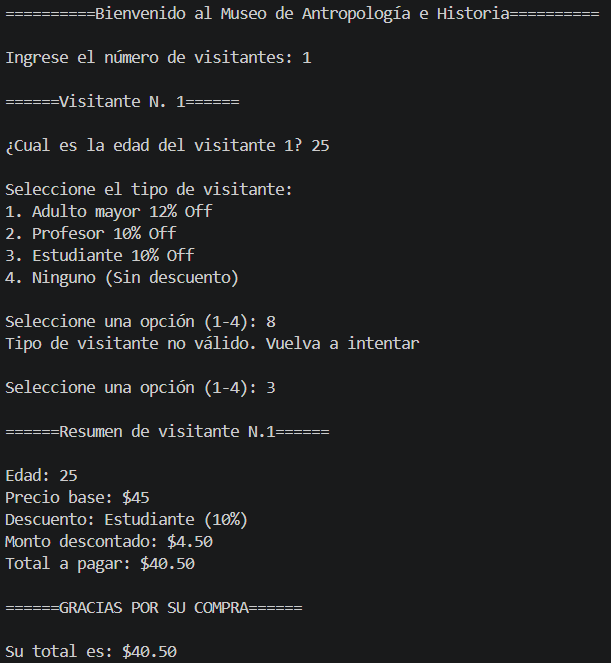
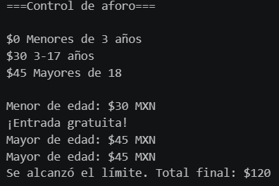
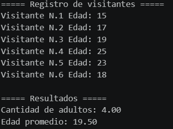
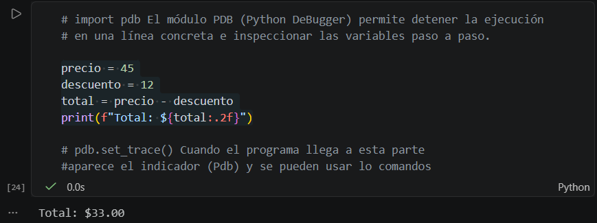
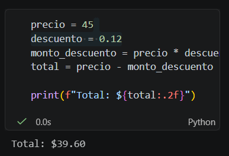
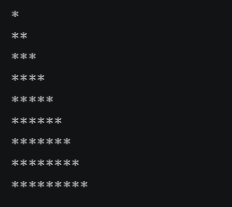

# Actividad 2
## Descripción del reto
### COBRO DE ENTRADAS DEL MUSEO

Desarrollar un programa en **Python** para cobrar las entradas de los visitantes que desean recorrer el **Museo de Antropología e Historia**, calculando el precio adecuado para cada visitante y aplicando descuentos por tipo de visitante bajo estrictas condiciones lógicas. El programa debe procesar a los visitantes mediante un **ciclo controlado**, aplicar los descuentos con una **tabla de verdad** que garantice un único descuento por boleto y desplegar el **total detallado** de todas las personas ingresadas.

## Requerimientos técnicos obligatorios

1. **Captura de visitantes:** El usuario debe poder ingresar el número total de visitantes que pagarán boleto, si son mayores de edad y el tipo de visitante de cada uno.
2. **Tabla de verdad de descuentos:** La matriz de descuentos debe estar estructurada lógicamente como una **tabla de verdad**, de modo que **solo se aplique un tipo de descuento por boleto** (adulto mayor 12%, profesor 10%, estudiante 10%).
3. **Ciclo controlado:** Se debe implementar un ciclo controlado (`for` o `while`) para procesar a los visitantes.
4. **`break` y `continue` obligatorios:** Dentro del ciclo es obligatorio el uso de **al menos una cláusula `break`** y **al menos una cláusula `continue`**.
5. **Total detallado:** El programa debe desplegar el total detallado a pagar de todas las personas ingresadas, considerando sus descuentos aplicables **de forma individual**.

## DOCUMENTACIÓN DE CÓDIGO

1. El programa solicita al usuario el número de visitantes que ingresarán (Captura la cantidad que procesará el programa), se agrega `int` para enteros.
2. Establecemos la variable en valor 0, que acumulará nuestros totales al final.
3. Ciclo controlado con `for` para capturar datos.
```python
num_visitantes = int(input("Ingrese el número de visitantes: "))
total_completo = 0

for i in range(1, num_visitantes + 1):
    print(f"\n======Visitante N. {i}======")
    edad = int(input(f"\n¿Cual es la edad del visitante {i}? "))
```

4. Validamos edades ingresadas por el usuario para asignarles el precio correspondiente

```python
    if edad <= 0:
        print("\nEdad no valida, visitante omitido")
        continue

    if edad < 3:
        precio = 0
        print("\n¡Entrada gratuita!")
        continue

    elif edad <=17:
        precio = 30

    else:
        precio = 45
```

5. Mostramos al usuario los tipos de visitantes, el descuento al que aplica y le solicitamos elegir uno.
6. Aplicamos un ciclo while para la selección de un solo tipo de descuento. El usuario solo puede elegir una opción de 1-4, en caso de elegir otro valor, el programa arroja un mensaje al usuario de que su tipo de visitante no es valido y vuelve a solicitar el tipo de visitante.
7. Usamos `break` para salir del ciclo una vez que se escoge un descuento válido.

```python
    print("\nSeleccione el tipo de visitante:")
    print("1. Adulto mayor 12% Off")
    print("2. Profesor 10% Off")
    print("3. Estudiante 10% Off")
    print("4. Ninguno (Sin descuento)\n")

    while True:

        tipo = int(input("Seleccione una opción (1-4): "))

        if tipo == 1:
            descuento = 0.12
            tipo_descuento = "Adulto mayor (12%)"
            break

        elif tipo == 2:
            descuento = 0.10
            tipo_descuento = "Profesor (10%)"
            break

        elif tipo == 3:
            descuento = 0.10
            tipo_descuento = "Estudiante (10%)"
            break

        elif tipo == 4:
            descuento = 0
            tipo_descuento = "Sin descuento"
            break

        else:
            print("Tipo de visitante no válido. Vuelva a intentar\n")
```

8. Calculamos nuestro monto de descuento y el precio ya con el descuento, previamente calculado, incluido.

```python
    monto_descuento = precio * descuento
    precio_con_desc = precio - monto_descuento
```

9. Mostramos al usuario el resumen del visitante ingresado una vez termina de ingresar sus datos.
10. Finalizamos acumulando los precios con descuento a la variable `total_completo` y mostramos al cliente su cuenta total.

```python
    print(f"\n======Resumen de visitante N.{i}======\n")
    print(f"Edad: {edad}")
    print(f"Precio base: ${precio}")
    print(f"Descuento: {tipo_descuento}")
    print(f"Monto descontado: ${monto_descuento:.2f}")
    print(f"Total a pagar: ${precio_con_desc:.2f}")

    #suma de precios
    total_completo += precio_con_desc


print("\n======GRACIAS POR SU COMPRA======")
print(f"\nSu total es: ${total_completo:.2f}")
```

Se adjunta evidencia de la ejecución correcta del código:



## Extra 1

Nuestro programa procesa visitantes con un ciclo while. Acumula los costos de los boletos y detiene el ciclo si el monto total alcanzado supera los $100.

1. Declaramos variables `total` en 0 para acumular al final y variable `visitante` en 1 para mostrar número de visitante en nuestro `input`.
2. Ciclo while para procesar visitantes, pedimos al usuario ingresar la edad para guardarla en la variable `edad` y determinamos si es menor a 3 años, su entrada es gratuita y continuamos con el siguiente visitante a procesar `continue`. Si la edad es igual a 17 o menor, se otorga costo de 30, de lo contrario se otorga costo de 45.
3. Acumulamos en 1 a `visitante` en todos los casos para que nuestra variable muestre el número correspondiente al usuario.

```python
total = 0
visitante = 1

while True:

    edad = int(input(f"Ingrese la edad del visitante N. {visitante}"))
    
    if edad < 3:
        visitante += 1
        print("¡Entrada gratuita!")
        continue

    elif edad <= 17:
        visitante += 1
        print("Menor de edad: $30 MXN")
        costo = 30
        
    else:
        visitante += 1
        print("Mayor de edad: $45 MXN")
        costo = 45
```

4. Agregamos nuestro acumulador para los costos de los boletos.
5. Si el total es mayor o igual a 100, entonces terminamos nuestro ciclo con `break` e indicamos al usuario que se alcanzó el límite.

```python
    total += costo

    if total >= 100:
        print(f"Se alcanzó el límite. Total final: ${total}")
        break
```

Se adjunta evidencia de la correcta ejecución del código:



## Extra 2

Nuestro programa pide el numero total de visitantes, captura su edad, determina la cantidad de adultos y el promedio de edad.

1. Pedimos al usuario la cantidad de visitantes
2. Establecemos en 0 las variables `adulto` para determinar la cantidad de adultos posteriormente y `edades` para acumular las edades asignadas por el usuario en la variable `edad`
3. Se le solicita al usuario la edad del visitante correspondiente y mostramos un pequeño resumen de lo capturado.
4. Acumulamos las edades en la variable `edades` sumando las asignadas previamente.
5. Si la edad es mayor o igual a 18, se acumula en 1 a la variable `adultos` para posteriormente mostrar la cantidad de adultos que se ingresaron.

```python
num_visitantes = int(input("Ingrese el número total de visitantes: "))

adultos = 0
edades = 0

for i in range(1, num_visitantes + 1):

    edad = int(input(f"Ingrese la edad del visitante {i}: "))
    print(f"Visitante N.{i} Edad: {edad}")

    edades += edad

    if edad >= 18:
        adultos += 1
```

6. Dividimos las edades entre el número de visitantes para asignar el valor a la variable `promedio`.
7. Finalmente mostramos los resultados insertando las variables `adultos`  `promedio` y usando `f-string` para formatear a 2 decimales.

```python
promedio = edades / num_visitantes

print("\n===== Resultados =====")
print(f"Cantidad de adultos: {adultos:.2f}")
print(f"Edad promedio: {promedio:.2f}")
```


## Extra 3

Se nos presenta un código con errores. Su objetivo es calcular el precio final de un boleto de $45 con descuento de 12%.

```python
precio = 45
descuento = 12
total = precio - descuento
print(f"Total: ${total:.2f}")
```
El error radica en que el descuento debe asignarse como 0.12 y asignarse primero a otra variable que asigne el resultado de la operación de, en este ejemplo, 45 * 0.12 y lo reste al total para dar el resultado correcto.

Procedemos a la realización y correción de la actividad.




### Codigo corregido:
```python
precio = 45
descuento = 0.12
monto_descuento = precio * descuento
total = precio - monto_descuento

print(f"Total: ${total:.2f}")
```

Se adjunta evidencia de la correcta ejecución del código:



## EXTRA 4

Este programa crea una piramide con la altura que sea capturada por el usuario.

1. Solicitamos altura de la pirámide con `int` para que sea número entero.

```python
altura = int(input("Ingrese la altura de la pirámide: "))
```
2. Este ciclo se encarga de controlar las filas de la piramide, generando los números de 1 hasta, el valor que se haya asignado en `altura`.
```python
for y in range(1, altura + 1):
```
3. Este ciclo anidado determina cuantós asteriscos dibujaremos en cada fila, dependiendo del valor asignado en `y`.
4. Usamos el parametro `end=""` para evitar un salto de línea después de imprimir cada asterisco.
```python
    for x in range(y):
        print("*", end="")
```
5. Una vez que nuestro ciclo termina de imprimir nuestros asteriscos, ahora sí nuestro `print()` hace el salto de línea.
```python
    print()
```
Se adjunta evidencia del código ejecutandose correctamente:

