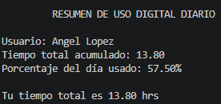

# Actividad 1
## Descripcion del reto
### Calculadora de Tiempo Digital

Debemos realizar una calculadora que registre el tiempo diario que una persona pasa en plataformas digitales. Con los datos capturados y procesados, se deberá mostrar un resumen ordenado de los resultados.

## Requerimientos
1. Se debe solicitar nombre de usuario mediante la función `input()`.
2. Solicitar tiempo dedicado a almenos 5 plataformas digitales.
3. Emplear la función `float()` para poder ingresar valores decimales.
4. Calcular la suma del tiempo total diario invertido en actividades digitales.
5. Debemos calcular el porcentaje del día utilizado en actividades digitales con la función `porcentaje = (tiempo_total / 24) * 100`
6. Mostrar en pantalla "Nombre de usuario", "Tiempo acumulado", "Porcentaje calculado"

## Proceso

1. Usuario ingresa los datos solicitados

```python
username = input("Por favor, ingresa tu nombre: ")
print("\nA continuación, ingresa el tiempo en horas:")

videojuegos = float(input("Videojuegos: "))
redes_sociales = float(input("Redes sociales (FB, IG, X, TikTok): "))
streaming = float(input("Plataformas de Streaming(Netflix, HBOMAX, Disney+, YT, PrimeVideo, etc.): "))
compras_online = float(input("Compras en línea (Apps como Amazon/Mercado Libre, Shein, AliExpress, etc): "))
trabajo_estudio_en_linea = float(input("Estudio o trabajo EN LÍNEA: "))
```

2. Se calcula la suma de los tiempos registrados y se calcula el porcentaje del día

```python
tiempo_total = (
    videojuegos
    +redes_sociales
    +streaming
    +compras_online
    +trabajo_estudio_en_linea
)

porcentaje_dia = (tiempo_total / 24) * 100
```

3. Se muestran el resumen de los resultados, considerando adicionalmente si, el resultado no pasa de las 24 hrs y si no son negativas. Se insertan las variables con  f-string para el resumen.

```python
print("\n         RESUMEN DE USO DIGITAL DIARIO           ")
print(f"\nUsuario: {username}")
print(f"Tiempo total acumulado: {tiempo_total:.2f}")
print(f"Porcentaje del día usado: {porcentaje_dia:.2f}%")

if tiempo_total > 24:
    print("\nNo puedes exceder las 24 hrs")

elif tiempo_total < 0:
    print ("\nNo puedes tener menos de 0 hrs")

else:
    print(f"\nTu tiempo total es {tiempo_total:.2f} hrs")
```

A continuación se adjunta evidencia de la salida de ejecución del código:



