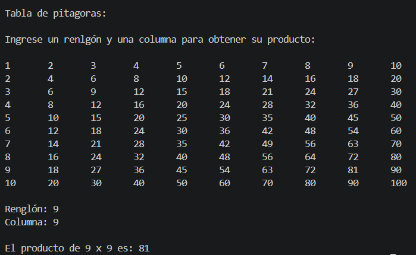
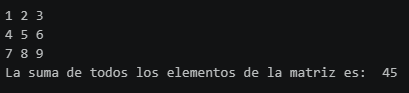
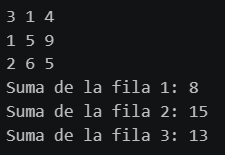
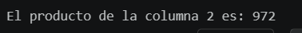
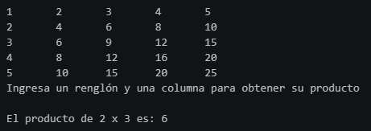

# Actividad 4
## Tabla de pitágoras en matriz y operaciones especiales
### Descripción del reto
Nuestro programa genera una tabla de 10x10, la muestra en pantalla y solicita al usuario seleccionar un renglón y una columna para obtener el producto de ambas extrayendolo directamente de la tabla, sin ninguna operacion con `*`.

Construcción de la matriz
1. Definimos el tamaño de 10 en la variable `size` 
2. Declaramos la variable tabla con una lista vacía que guardará la matriz completa
3. Ciclo `for` en el que recorremos los renglones de 1 a `size`(10). suma 1 a `size` para que pueda recorrer 10 y no 9.
4. En cada vuelta, genera una lista nueva vacía para guardar los productos de ese renglón.
5. Anidamos un ciclo `for` en el que recorreremos ahora las columnas de 1 a `size`(10)
6. Creamos la variable `producto` que usaremos de acumulador donde se harán las sumas sucesivas simulando la multiplicación. 
7. Nuevamente anidamos otro ciclo `for`, este se repetirá el número de veces que indique `columna`
8. Por cada vuelta, sumará `renglon` al acumulador `producto`.
9. Agregamos el producto calculado al final de la fila actual con `fila.append(producto)`. Importante hacer esto fuera de la indentación de las sumas repetidas.
10. Igualmente, pero ahora fuera de la indemntación del ciclo de columnas, agregamos la fila completa  al final de la matriz.
```python
size = 10

tabla = []
for renglon in range(1, size + 1):
    fila = []
    for columna in range(1, size + 1):
        producto = 0
        for numveces in range(columna):
            producto = producto + renglon
        fila.append(producto)
    tabla.append(fila)
```
Función sin `return` para imprimir nuestra tabla

11. En nuestra función, usamos ciclo `for` para recorrer la tabla una fila ala vez
12. `linea`creará un texto vacío, se pone dentro de este ciclo para reiniciar por cada fila nueva
13. Anidamos ciclo `for` que recorrerá cada `valor` por cada vuelta.
14. En este ciclo, se le concatena a `linea` nuestro `valor` que convertimos a texto con `str()`, seguido de un tabulador `"\t"`que separará las columnas
15. Fuera de este ciclo, imprimimos el texto de `linea` en la fila actual. 
```python
def imprimir_tabla(tabla):
    for fila in tabla:
        linea = ""
        for valor in fila:
            linea = linea + str(valor) + "\t"
        print(linea)
```
Función con `return`
16. Definimos función que recibe matriz (`tabla`) y ambos factores (`renglon` y `columa`).
17. Rescata los valores buscando su posición (como una coordenada) con los valores asignados en `renglon` y `columna`. Se les resta 1 (`[renglon - 1]``[columna - 1]`) debido a que las listas se cuentan a partir de 0. Ese valor lo regresamos con `return`

```python
def consultar_producto(tabla, renglon, columna):
    return tabla[renglon - 1][columna - 1]
```

Programa principal
18. Mostramos título e indicaciones previo a la impresión de la tabla.
19. Llamamos a nuestra función para imprimir la matriz.
20. Solicitamos al usuario los dos factores que se usarán para asignarlos a `renglon` y `columna` respectivamente
21. Llamamos a nuestra función que recibirá la matriz y ambos factores, y guardaremos el valor que nos regresa en la variable `resultado`.
22. Finalizamos imprimiendo el resultado del producto.
```python
print("\nTabla de pitagoras:")
print("\nIngrese un renlgón y una columna para obtener su producto:\n")

imprimir_tabla(tabla)

renglon = int(input("\nRenglón: "))
columna = int(input("Columna: "))

resultado = consultar_producto(tabla, renglon, columna)
print(f"\nEl producto de {renglon} x {columna} es: {resultado}")
```

Se adjunta evidencia de la salida:

---

## EXTRA 1
1. Definimos nuestra función para sumar
2. Establecemos suma en 0 para posteriormente acumular nuestros valores y calcular nuestra suma
3. Comenzamos nuestro ciclo `for` detectando en `fila` los valores que saca de `matriz`, en este caso, sacará de nuestra lista de lstas `[1, 2, 3]`, en la primer vuelta y seguirá así sucesivamente, en este caso 3 vueltas.
4. El siguiente `for` se encuentra anidado al anterior para que obtenga en `valor`, los valores identificados en `fila`, posteriormente los va acumulando en `suma` con los obtenidos en `valor`
5. Regresamos valor de `suma` con `return` para presentar nuestro resultado.

```python
def suma_matriz(matriz):
    suma = 0
    for fila in matriz:
        for valor in fila:
            suma = suma + valor
    return suma
```

6. Definimos nuestra función para imprimir la matriz
7. Ciclo `for` en el que `fila` recorre cada sublista de `matriz`.
8. Declaramos variable `linea = ""` con comillas para poder especificar tipo de dato str y así podamos consruir en esta el texto que imprimiremos
9. Ciclo `for` anidado, similar a la función anterior, recorrerá los valores identificados en `fila`
10. La siguiente linea toma nuestro texto en `linea`, le añade el valor (previamente convertido a texto con `str(valor)` para poder concatenar textos) y le añade un espacio para separar numeros.
11. Imprimimos resultados, en este bloque no regresamos valor, solo mostramos en pantalla.

```python
def imprimir_matriz(matriz):
    for fila in matriz:
        linea = ""
        for valor in fila:
            linea = linea + str(valor) + " "
        print(linea)
```

12. Creamos nuestra variable con los datos
13. Llamamos a nuestra funcion con `imprimir_matriz(matriz)` para mostrarla en nuestra salida.
14. Llamamos a la funcion que devuelve valor para asignarlo en nuestra variable `total` y finalizamos mostrando este resultado 
``

```python
matriz = [
    [1, 2, 3],  #fila1
    [4, 5, 6],  #fila2
    [7, 8, 9]   #fila3
    ]
imprimir_matriz(matriz)

total = suma_matriz(matriz)
print("La suma de todos los elementos de la matriz es: ", total)
```

Evidencia de salida:


---

## EXTRA 2
1. Definimos función para sumar los valores de cada fila.
2. Definimos `suma = 0` previo al `for` para reiniciar en cada vuelta
3. Ciclo `for` para identificar los valores de cada fila (`valor` in `fila`)
4. Acumulamos los valores en `suma` para sumarlos
5. Devolvemos el valor obtenido de la suma.
```python
def suma_fila(fila):
    suma = 0
    for valor in fila:
        suma = suma + valor
    return suma
```

6. Definimos función que imprimirá nuestra matriz.
7. Ciclo `for` en el que `fila` recorre cada sublista de `matriz`.
8. Declaramos variable `linea = ""` con comillas para poder especificar tipo de dato str y así podamos consruir en esta el texto que imprimiremos
9. Ciclo `for` anidado, similar a la función anterior, recorrerá los valores identificados en `fila`
10. La siguiente linea toma nuestro texto en `linea`, le añade el valor (previamente convertido a texto con `str(valor)` para poder concatenar textos) y le añade un espacio para separar numeros.
11. Imprimimos resultados, no regresa valor, solo muestra la matriz.

```python
def imprimir_matriz(matriz):
    for fila in matriz:
        linea = ""
        for valor in fila:
            linea = linea + str(valor) + " "
        print(linea)
```

12. Declaramos variable `matriz` con los datos 
13. Llamamos a la variable para imprimir nuestra matriz
14. Creamos variable `sumlist` en 0, esta es unicamente para contar el número de fila en el que vamos en nuestro print.
15. Recorremos matriz fila por fila (`fila` in `matriz`) fuera de nuestras funciones
16. Nuestra variable `resultado` llamará a la función para sumar y como es una por vuelta, nos dará el resultado de las 3 filas por separado.
17. Acumulamos +1 a `sumlist` por cada vuelta para que nuestro print indique correctamente el número de vuelta en el que vamos
18. Finalizamos mostrando resultados.
```python
matriz = [
    [3, 1, 4],
    [1, 5, 9],
    [2, 6, 5]
    ]

imprimir_matriz(matriz)

sumlist = 0
for fila in matriz:
    resultado = suma_fila(fila)
    sumlist += 1
    print(f"Suma de la fila {sumlist}: {resultado}")
```
Se adjunta evidencia de nuestra salida:


---

## EXTRA 3

1. Definimos función para multiplicar columnas
2. Declaramos variable `producto = 1` para poder "Multiplicar" (sumar x cantidad sucesivamente), no en cero, ya que no podriamos sumar sucesivamente
3. Ciclo `for` para identificar en las filas que hay en `matriz`
4. En base a la fila de la vuelta correspondiente, buscamos la columna deseada (Asignada por el usuario)
5. Declaramos variable `sumsucesiva = 0` antes del siguiente `for` anidado para poder reiniciar la suma por cada vuelta.
6. Ciclo `for` anidado para poder sumar sucesivamente según el valor de las siguientes columnas, `numveces` es unicamente para repetir el ciclo, `range(valorxcol)` nos determinará el número de veces que se repetirá para sumar sucesivamente simulando unba multiplicación.
7. Por cada vuelta `sumsucesiva` se le acumula `sumsucesiva` + `producto`.
8. Actualizamos la variable `producto` para que podamos seguir acumulando los valores de manera que simulen correctamente la mupltiplicación. Lo movemos a la indentación del `for fila` para que no se repita entre el rango asignado de `valorxcol`
9. Regresamos el valor acumulado en `producto`.
```python
def multiplicar_columna(matriz, columna):
    producto = 1
    for fila in matriz:
        valorxcol = fila[columna]
        sumsucesiva = 0
        for numveces in range(valorxcol):
            sumsucesiva = sumsucesiva + producto
        producto = sumsucesiva
    return producto
```

10. Declaramos nuestra variable `matriz` con sus respectivas listas.
11. Solicitamos al usuario la columna que vamos a multiplicar, se especifica 0, 1, 2. En base a la opción elegida, declarará el valor de la variable `columna`
12. Llamamos a nuestra función `multiplicar_columna(matriz, columna)` declarandola en `resultado`
13. Finalizamos mostrando el resultado del producto de la columna seleccionada.

```python
matriz = [
    [1, 2, 3],
    [4, 5, 6],
    [7, 8, 9],
    [2, 4, 6]
]

columna = int(input("Ingrese el numero de columna a multiplicar: (0, 1, 2)"))
resultado = multiplicar_columna(matriz, columna)
print(f"El producto de la columna {columna} es: {resultado}")
```
Se adjunta evidencia de la salida del ejercicio:

---

## EXTRA 4
1. Definimos nuestra función que creará nuestra tabla.
2. Declaramos variable `tabla = []` para generar la lista vacía en la que iremos añadiendo los valores.
3. Ciclo `for` para recorrer los renglones en un rango de 1 a la cantidad asignada por el usuario en `size`.
4. Ciclo `for` anidado que recorrerá ahora las columnas de 1 a `size` por cada `renglon`.
5. Declaramos variable `producto = 0` para acumular
6. Anidamos otro ciclo en el que por cada `numveces` de `columna` suma el valor de renglon a producto.
7. Usamos `fila.append(producto)` en la indentación de `producto = 0` para que cada produto calculado se agregue a la fila actual
8. Usamos `tabla.append(fila)` en indentación de `fila ` para que, cuando una fila se complete, se agregue a la matriz `tabla`.
9. Regresamos el valor actual de nuestra matriz con `return`

```python
def generar_tabla(size):
    tabla = []
    for renglon in range(1, size + 1):
        fila = []
        for columna in range(1, size + 1):
            producto = 0
            for numveces in range(columna):
                producto = producto + renglon
            fila.append(producto)
        tabla.append(fila)
    return tabla
```

10. Creamos nuestra función para imprimir nuestra tabla
11. Ciclo `for` para recorrer cada `fila` en `tabla`
12. Por cada fila, genera texto en `linea` concatenando los valores ya convertidos a texto con `str()` y se agrega el tabulador con `"\t`
13. Finaliza imprimendo las filas generadas en `linea`
```python
def imprimir_tabla(tabla):
    for fila in tabla:
        linea = ""
        for valor in fila:
            linea = linea + str(valor) + "\t"
        print(linea)
```

14. Solicitamos al usuario el tamaño de la tabla, el valor se asignará en la variable `size`
15. Si el tamaño es menor que 2 ó mayor que 5, muestra nuestro mensaje de error
16. Si el tamaño es válido, llamamos a nuestra función para generar la matriz y declararla en `tabla` 
17. Llamamos a nuestra función para imprimir nuestra tabla
18. Solicitamos al usuario ingresar un renglón y una columna para obtener su producto y asignamos los valores en `renglon` o `columna` respectivamente.
19. Rescatamos el producto directamente desde la tabla consultando su posición con `resultado = tabla[renglon - 1][columna - 1]`, se le resta 1 porque las listas empiezan en la posición 0.
20. Finalmente imprimimos los resultados
```python
size = int(input("Tamaño de la tabla (entre 2 y 5): "))

if size < 2 or size > 5:
    print("El tamaño debe ser entre 2 y 5.")
else:
    tabla = generar_tabla(size)
    imprimir_tabla(tabla)

    print("Ingresa un renglón y una columna para obtener su producto\n")
    renglon = int(input("Renglon: "))
    columna = int(input("Columna: "))
    
    resultado = tabla[renglon - 1][columna - 1]
    print(f"El producto de {renglon} x {columna} es: {resultado}")
```

Se adjunta evidencia de la salida:


---