# Actividad 5
## Menú interactivo: Tuplas, Diccionarios, Excepciones y Strings
### Descripción del reto
Nuestro programa crea un menú principal controlado por un ciclo `while`, que le permite al usuario elegir entre cuatro secciones (Tuplas, Diccionarios, Excepciones, Strings) o finalizar el programa (Opción 5). Cada sección se resuelve en su propia función, a la que el menú llama según la opción elegida.

1. Definimos la función `sumar_tupla` que se usará en nuestra opción 1, que recibe una lista y usa un acumulador `suma` inicializado en 0; con un ciclo `for` recorre cada `elemento` y lo va sumando, y al final regresa el total con `return`.
```python
def sumar_tupla(lista):
    suma = 0
    for elemento in lista:
        suma = suma + elemento
    return suma
```

2. Definimos `procesar_tuplas()`: crea la tupla `numeros` con 5 valores iniciales e imprime el tercer elemento con `numeros[2]` (ya que se cuenta desde 0).
3. Captura dos números nuevos con `input()` convertidos a `int`, los empaqueta en la tupla `nuevos` y concatena ambas tuplas con `+` para formar `numeros_actualizados`.
4. Convierte la tupla resultante en lista con `list()`, la ordena con `.sort()` y llama a `sumar_tupla()` para obtener y mostrar la suma total.
```python
def procesar_tuplas():
    numeros = (909, 231, 64, 124, 345)

    print(f"\nTercer elemento: {numeros[2]}")

    num1 = int(input("\nIngresa un nuevo número a añadir: "))
    num2 = int(input("Ingresa otro nuevo número a añadir: "))

    nuevos = (num1, num2)
    numeros_actualizados = numeros + nuevos

    print(f"\nNueva tupla: {numeros_actualizados}")

    lista_numeros = list(numeros_actualizados)
    lista_numeros.sort()
    print(f"\nLista ordenada: {lista_numeros}")

    suma_total = sumar_tupla(lista_numeros)
    print(f"\nSuma total: {suma_total}")
```

5. Definimos `buscar_telefono(contactos, nombre)`, función que regresa directamente el valor a la clave en el diccionario.
```python
def buscar_telefono(contactos, nombre):
    return contactos[nombre]
```

6. Definimos `procesar_diccionarios(contactos)`: captura el nombre nuevo con `input().capitalize()` (para normalizar la primera letra) y el teléfono, y agrega el contacto directamente al diccionario recibido como parámetro con `contactos[nuevo_nombre] = nuevo_tel`.
7. Extrae los nombres con `.keys()`, los convierte en lista y los une en un solo texto con `", ".join(nombres)`.
8. Para buscar el teléfono usamos un ciclo `while True`: pide el nombre, y si `nombre in contactos` obtiene el teléfono con `buscar_telefono()`, lo imprime y sale con `break`; si no existe, avisa y vuelve a pedirlo.
```python
def procesar_diccionarios(contactos):
    nuevo_nombre = input("\nNombre del nuevo contacto: ").capitalize()
    nuevo_tel = input("Teléfono del nuevo contacto: ")

    contactos[nuevo_nombre] = nuevo_tel

    nombres = list(contactos.keys())
    nombres_texto = ", ".join(nombres)

    print(f"\nContactos registrados: {nombres_texto}")

    while True:
        buscar_nombre = input("\nNombre a buscar: ").capitalize()
        if buscar_nombre in contactos:
            telefono = buscar_telefono(contactos, buscar_nombre)
            print(f"El teléfono de {buscar_nombre} es: {telefono}")
            break
        else:
            print("Contacto no encontrado.")
```

9. Creamos el diccionario `contactos` con tres contactos iniciales, fuera de cualquier función, para que se comparta entre todas las llamadas al menú (así conservamos los contactos que se agregan mientras el programa siga corriendo).
```python
contactos = {
    "Esme": "555-3007",
    "Daniel": "555-6705",
    "Axel": "555-1651"
}
```

10. Definimos `procesar_excepciones()`: dentro de un `try`, captura dos enteros con `int(input())` y calcula/imprime su suma; si alguna conversión falla (texto o vacío), lo captura `except ValueError` con un mensaje controlado.
11. Anidamos un segundo `try` dentro del primero, específico para la división, con su propio `except ZeroDivisionError` que muestra un mensaje si el segundo número es 0.
```python
def procesar_excepciones():
    try:
        numero1 = int(input("\nIngresa el primer número entero: "))
        numero2 = int(input("Ingresa el segundo número entero: "))

        suma = numero1 + numero2
        print(f"\nLa suma de {numero1} + {numero2} es: {suma}")

        try:
            resultado = numero1 / numero2
            print(f"\nLa división de {numero1} entre {numero2} es: {resultado}")
        except ZeroDivisionError:
            print("\nError: no se puede dividir entre cero.")

    except ValueError:
        print("\nError: debes ingresar únicamente números enteros.")
```

12. Definimos `contar_palabras(texto)`, que separa el texto en palabras con `.split()` y regresa la cantidad con `len()`.
```python
def contar_palabras(texto):
    palabras = texto.split()
    return len(palabras)
```

13. Definimos `procesar_strings()`: captura un mensaje con `input()`, imprime su longitud con `len()` y lo convierte a mayúsculas con `.upper()`.
14. Pide la palabra a buscar y la nueva palabra, y busca la posición de la palabra de forma insensible a mayúsculas/minúsculas con `mensaje.lower().find(palabra_buscada.lower())`.
15. Si la encuentra (`posicion != -1`), reconstruye el mensaje con *slicing*: el texto antes de la palabra (`mensaje[:posicion]`) + la palabra nueva + el texto después de la palabra (`mensaje[posicion + len(palabra_buscada):]`); si no la encuentra, avisa al usuario que no se reemplazó nada.
16. Finalmente llam a `contar_palabras(mensaje)` sobre el mensaje original y muestra el total de palabras.
```python
def procesar_strings():
    mensaje = input("\nEscribe un mensaje: ")

    print(f"\nCantidad de caracteres em el mensaje: {len(mensaje)}")

    mensaje_mayus = mensaje.upper()
    print(f"\nTu mensaje en mayúsculas: {mensaje_mayus}")

    palabra_buscada = input("Palabra que quieres reemplazar: ")
    palabra_nueva = input("Palabra nueva: ")

    posicion = mensaje.lower().find(palabra_buscada.lower())

    if posicion != -1:
        mensaje_reemplazado = mensaje[:posicion] + palabra_nueva + mensaje[posicion + len(palabra_buscada):]
        print(f"Mensaje con la palabra reemplazada: {mensaje_reemplazado}")
    else:
        print("\nLa palabra no se encontró en el mensaje. No se reemplazó.\n")

    total_palabras = contar_palabras(mensaje)
    print(f"El mensaje contiene {total_palabras} palabras")
```

17. Definimos `mostrar_menu()`, esta función solo imprime las 5 opciones del menú principal.
```python
def mostrar_menu():
    print("\n====== MENÚ PRINCIPAL ======\n")
    print("1. Tuplas")
    print("2. Diccionarios")
    print("3. Excepciones")
    print("4. Strings")
    print("5. Finalizar")
```

18. Usamos ciclo `while True` para mantener el menú activo. En cada vuelta muestra el menú, captura la opción con `input()` y según la opción, llama a la función correspondiente.
19. La opción `"5"` imprime un mensaje de despedida y usa `break` para terminar el ciclo; cualquier valor no contemplado llvará al `else`, que avisa que la opción no es válida y vuelve a mostrar el menú.
```python
while True:
    mostrar_menu()
    opcion = input("Elige una opción: ")

    if opcion == "1":
        print("\n===TUPLAS===")
        procesar_tuplas()
    elif opcion == "2":
        print("\n===DICCIONARIOS===")
        procesar_diccionarios(contactos)
    elif opcion == "3":
        print("\n===EXCEPCIONES===")
        procesar_excepciones()
    elif opcion == "4":
        print("\n===STRINGS===")
        procesar_strings()
    elif opcion == "5":
        print("\nPrograma finalizado.\n")
        break
    else:
        print("\nOpción no válida, intenta de nuevo.")
```

Se adjunta evidencia de las salidas:

### SALIDA DE OPCIÓN 1
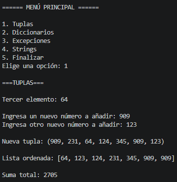
### SALIDA DE OPCIÓN 2 (con mensaje de contacto no encontardo)
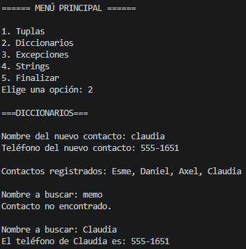
### SALIDA DE OPCIÓN 3 (con mensaje de Error al dividir entre 0 en la segunda acción)
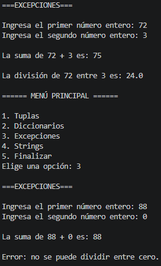
### SALIDA DE OPCIÓN 4
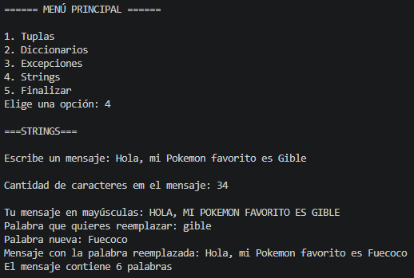
### SALIDA DE OPCIÓN 5 (con mensaje de opción invalida)
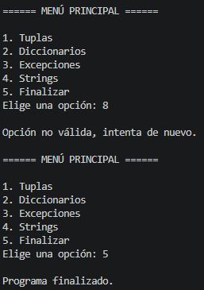

---

## EXTRA 1: Sistema de calificaciones con tuplas
1. Definimos `sumar_elementos`, que recibe una lista, acumula sus valores en `suma` con un ciclo `for` y regresa el total con `return`.
2. Creamos la tupla `calificaciones` con los cinco valores iniciales.
3. Imprimimos el tercer elemento con `calificaciones[2]`.
4. Capturamos dos calificaciones nuevas con `input()` convertidas a `float`, las empaquetamos en `cal_nuevas` y concatenamos ambas tuplas con `+`.
5. Convertimos la tupla en lista con `list()`, la ordenamos de mayor a menor con `.sort(reverse=True)` y llamamos a `sumar_elementos()` para obtener y mostrar la suma total.
```python
def sumar_elementos(lista):
    suma = 0
    for elemento in lista:
        suma = suma + elemento
    return suma

calificaciones = (
    7.5,
    9.0,
    8.0,
    6.5,
    10.0
)

print(f"Tercera calificación: {calificaciones[2]}")

calnueva1 = float(input("Nueva calificación 1: "))
calnueva2 = float(input("Nueva calificación 2: "))

cal_nuevas = (calnueva1, calnueva2)

calificaciones_actualizadas = calificaciones + cal_nuevas

print(f"Nueva tupla: {calificaciones_actualizadas}")

lista_calificaciones = list(calificaciones_actualizadas)
lista_calificaciones.sort(reverse=True)

print(f"Lista ordenada: {lista_calificaciones}")

suma_total = sumar_elementos(lista_calificaciones)
print(f"Suma total: {suma_total}")
```
Se adjunta evidencia de la salida:
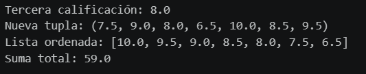
---

## EXTRA 2: Agenda de contactos con búsqueda
1. Definimos `buscar_telefono(agenda, buscar_nombre)`, que regresa directamente el valor de esa clave en el diccionario.
2. Creamos el diccionario `agenda` con los tres contactos iniciales.
3. Capturamos el nombre nuevo con `.capitalize()` y el teléfono, y agregamos el contacto con `agenda[nuevo_nombre] = nuevo_tel`.
4. Extraemos los nombres con `.keys()` y los unimos en un solo texto con `", ".join(nombres)`.
5. Pedimos el nombre a buscar y llamamos a `buscar_telefono()` para obtener y mostrar su teléfono.
```python
def buscar_telefono(agenda, buscar_nombre):
    return agenda[buscar_nombre]

agenda = {
    "Ana": "555-0101",
    "Luis": "555-0102",
    "Mía": "555-0103"
}

nuevo_nombre = input("Nombre del contacto a agregar: ").capitalize()
nuevo_tel = input("Teléfono del contacto a agregar: ")

agenda[nuevo_nombre] = nuevo_tel

nombres = list(agenda.keys())
nombresdeluxe = ", ".join(nombres)

print(f"Contactos registrados: {nombresdeluxe}")

buscar_nombre = input("Nombre a buscar: ")
telefono_encontrado = buscar_telefono(agenda, buscar_nombre)
print(f"El teléfono de {buscar_nombre} es: {telefono_encontrado}")
```
Se adjunta evidencia de la salida:
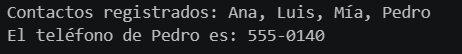
---

## EXTRA 3: Calculadora segura con manejo de excepciones
1. Dentro de un `try`, capturamos el dividendo y el divisor con `int(input())`; si el usuario escribe texto, se lanza un `ValueError`.
2. Calculamos e imprimimos la división; si el divisor es 0, se lanza un `ZeroDivisionError`.
3. El `except ValueError` captura el caso de una entrada no numérica, con un mensaje controlado.
4. El `except ZeroDivisionError`, en su propio bloque, captura específicamente la división entre cero con un mensaje de error.
```python
try:
    numero1 = int(input("Ingresa el primer número (dividendo) entero: "))
    print(f"Seleccionado: {numero1}")
    numero2 = int(input("Ingresa el segundo número (divisor) entero: "))
    print(f"Seleccionado: {numero2}")

    resultado = numero1 / numero2
    print(f"{numero1} dividido entre {numero2} es: {resultado}")

except ValueError:
    print("Error: Estimado usuario, ingrese únicamente números enteros.")

except ZeroDivisionError:
    print("Error: No es posible dividir entre cero. Ingresa un divisor distinto de 0.")
```
Se adjunta evidencia de la salida:
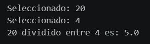
Y evidencia de salida con error al dividir entre cero:
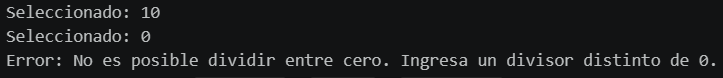

---

## EXTRA 4: Analizador de mensajes con strings
1. Definimos `contar_palabras(mensaje)`, que separa el texto con `.split()` y regresa la cantidad con `len()`.
2. Creamos la variable `mensaje` con el texto fijo del enunciado.
3. Imprimimos su longitud con `len()` y lo convertimos a mayúsculas con `.upper()`.
4. Reemplazamos "Python" por "programación" con `.replace()`, guardando el resultado en una variable nueva (el `mensaje` original no cambia, porque los strings son inmutables).
5. Llamamos a `contar_palabras(mensaje)` sobre el mensaje original y mostramos el resultado.
```python
def contar_palabras(mensaje):
    palabras = mensaje.split()
    return len(palabras)

mensaje = "Python es un lenguaje poderoso"

print(f"Longitud del mensaje: {len(mensaje)}")

mensaje_mayus = mensaje.upper()
print(f"En mayúsculas: {mensaje_mayus}")

palabra_reemplazada = mensaje.replace("Python", "programación")
print(f"Texto reemplazado: {palabra_reemplazada}")

cantidad_palabras = contar_palabras(mensaje)
print(f"Palabras totales: {cantidad_palabras}")
```
Se adjunta evidencia de la salida:
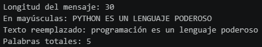 
---

## DESAFÍO EXTRA 1: Lista de espera con tuplas
1. Creamos la tupla `espera` con los nombres iniciales.
2. Imprimimos el tercer elemento con `espera[2]`.
3. Capturamos dos nombres nuevos con `input().capitalize()`, los empaquetamos en `adicionales` y concatenamos ambas tuplas con `+`.
4. Convertimos la tupla resultante en lista con `list()` y la ordenamos alfabéticamente con `.sort()`.
5. Imprimimos la lista ordenada uniendo cada nombre con un salto de línea usando `"\n".join(listanva)` directamente dentro del f-string, y mostramos la cantidad total con `len()`.
```python
espera = (
    "María",
    "José",
    "Carlos",
    "Lucia"
)

print(f"\nNombre de la tercer persona: {espera[2]}")

nombre1 = input("Captura un nuevo nombre: ").capitalize()
nombre2 = input("Captura un nuevo nombre más: ").capitalize()

adicionales = (nombre1, nombre2)

espera_actualizada = espera + adicionales
listanva = list(espera_actualizada)

listanva.sort()

print(f"\nLista de espera ordenada: \n{"\n".join(listanva)}")
print(f"\nCantidad total de personas: {len(listanva)}")
```
Se adjunta evidencia de la salida:
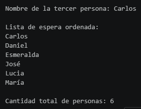
---

## DESAFÍO EXTRA 2: Contador de votos con diccionario
1. Creamos el diccionario `votos` con los tres colores en 0, y `conteo` inicializado en 1 para llevar la cuenta de votos válidos.
2. El `while conteo <= 5` se repite hasta contar 5 votos válidos (los inválidos no incrementan `conteo`).
3. Capturamos el voto con `.capitalize()`; si el color existe en `votos`, sumamos 1 con `votos[voto] += 1` e incrementamos `conteo`; si no, avisamos sin contar el intento.
4. Al terminar, recorremos el diccionario con `.items()` (`a` = color, `b` = votos) e imprimimos el resultado de cada uno.
```python
votos = {
    "Rojo": 0,
    "Azul": 0,
    "Verde": 0
}
conteo = 1
while conteo <= 5:
    voto = input("Ingresa el color de tu voto(Rojo, Verde o Azul): ").capitalize()

    if voto in votos:
        print(f"Voto valido para {voto}")
        votos[voto] += 1
        conteo += 1
    else:
        print("Voto no válido")

print("\n======Resultados======")
for a, b in votos.items():
    print(f"Opción {a}, votos: {b}")
```
Se adjunta evidencia de la salida:
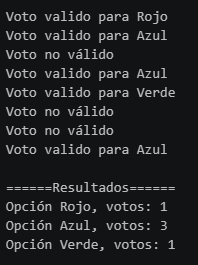
---

## DESAFÍO EXTRA 3: Validación robusta de entrada
1. El `while True` se repite hasta que se ejecuta un `break`.
2. Dentro del `try`, capturamos los dos números con `int(input())`; si ambos se capturan sin error, ejecutamos `break`.
3. Si alguna conversión falla, `except ValueError` muestra un mensaje y deja que el `while` se repita (no hay `break` en ese caso).
4. Ya fuera del ciclo, con los dos números válidos, abrimos un segundo `try` para la división, con `except ZeroDivisionError` para el caso del divisor en 0.
```python
while True:
    try:
        numero1 = int(input("Ingresa el primer número entero: "))
        print(f"Seleccionado: {numero1}")
        numero2 = int(input("Ingresa el segundo número entero: "))
        print(f"Seleccionado: {numero2}")   
        break

    except ValueError:
        print("Entrada inválida, vuelva a intentar. Por favor ingresa números enteros.")
        
try:
    resultado = numero1 / numero2
    print(f"Resultado de la división de {numero1}÷{numero2}: {resultado}")
except ZeroDivisionError:
    print("Error: no se puede dividir entre cero.")
```
Se adjunta evidencia de la salida:
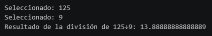
---

## DESAFÍO EXTRA 4: Analizador de textos
1. Definimos `contar_palabras(frase)`, que separa el texto con `.split()` y regresa la cantidad con `len()`.
2. Capturamos la frase con `input()`, imprimimos su longitud con `len()` y la convertimos a mayúsculas con `.upper()`.
3. Reemplazamos "Python" por "programación" con `.replace()`.
4. Llamamos a `contar_palabras(frase)` sobre la frase original y mostramos el resultado.
```python
def contar_palabras(frase):
    palabras = frase.split()
    return len(palabras)

frase = input("Escribe una frase: ").capitalize()

print(f"Longitud de la frase: {len(frase)}")

frase_mayus = frase.upper()
print(f"Frase en mayúsculas: {frase_mayus}")

frase_reemplazada = frase.replace("Python", "programación")
print(f"Frase con la palabra reemplazada: {frase_reemplazada}")

cantidad_palabras = contar_palabras(frase)
print(f"La frase contiene {cantidad_palabras} palabras")
```
Se adjunta evidencia de la salida:
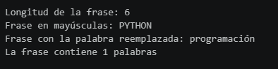
---

## DESAFÍO EXTRA 5: Minimenú modular integrador
1. Creamos el diccionario `contactos` con seis nombres y teléfonos.
2. El `while True` mantiene el menú activo; en cada vuelta se muestran las 5 opciones y se captura la elección con `opcion = int(input(...))`.
3. **Opción 1**: pide cuántos números se capturarán, los recibe uno por uno con un `for` y `.append()`, y los ordena con `sorted()` (que regresa una lista nueva sin modificar la original).
4. **Opción 2**: pide el nombre, lo capitaliza con `.capitalize()`, verifica si existe con `in` y muestra el teléfono o un mensaje de "no encontrado".
5. **Opción 3**: dentro de un `try`, pide dividendo y divisor como `float`, calcula la división y la muestra; `except ZeroDivisionError` captura la división entre cero.
6. **Opción 4**: pide un mensaje, cuenta las palabras con `.split()` y `len()`, y los caracteres totales con `len(mensaje)`.
7. **Opción 5**: imprime despedida y usa `break` para salir del `while True`; cualquier otro valor cae en el `else`, avisa que no es válida y el ciclo vuelve a mostrar el menú.
```python
contactos = {
    "Leonel": "4863259452",
    "Guadalupe": "2698745201",
    "Maria": "6315795120",
    "Daniel": "5674206703",
    "Aldo": "4789563210",
    "Vania": "3246679632"
}

while True:
    print("\n====== MINIMENÚ ======")
    print("1. Mostrar números ordenados")
    print("2. Buscar teléfono")
    print("3. Dividir dos números")
    print("4. Analizar mensaje")
    print("5. Salir")

    opcion = int(input("Selecciona una opción: "))

    if opcion == 1:
        print("\nSELECCIONADO: 1. Mostrar números ordenados")
        numeros = []

        cant_num = int(input("Cuántos números ordenarás?: "))
        
        for i in range(cant_num):   
            numeroslist = int(input("Ingresa los numeros a ordenar: "))
            numeros.append(numeroslist)

        numeros_ordenados = sorted(numeros)
        print(f"\nNúmeros ordenados: {numeros_ordenados}")

    elif opcion == 2:
        print("\nSELECCIONADO: 2. Buscar teléfono")

        nombre = input("\nIngresa el nombre del contacto: ").capitalize()

        if nombre in contactos:
            print(f"Teléfono de {nombre}: {contactos[nombre]}")
        else:
            print("Contacto no encontrado.")

    elif opcion == 3:
        print("\nSELECCIONADO: 3. Dividir dos números")

        try:
            numero1 = float(input("\nIngresa el dividendo: "))
            numero2 = float(input("Ingresa el divisor: "))

            resultado = numero1 / numero2

            print(f"Resultado de la división de {numero1} entre {numero2}: {resultado}")

        except ZeroDivisionError:
            print("Error: no se puede dividir entre cero.")

    elif opcion == 4:
        print("\nSELECCIONADO: 4. Analizar mensaje")
        mensaje = input("\nIngresa un mensaje: ")
        print(f"Mensaje recibido: {mensaje} ")

        palabras = mensaje.split()
        print(f"Palabras en el mensaje: {len(palabras)}")
        print(f"Cantidad de caracteres: {len(mensaje)}")

    elif opcion == 5:
        print("\nPrograma finalizado.")
        break

    else:
        print(f"\nOpción {opcion} no válida.")
```
Se adjunta evidencia de las salidas:
### Salida de OPCIÓN 1
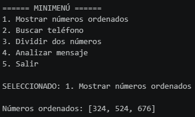
### Salida de OPCIÓN 2
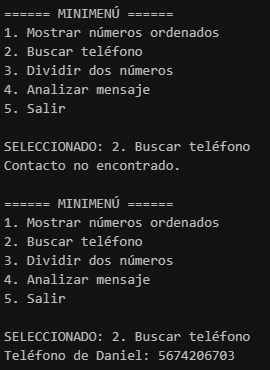
### Salida de OPCIÓN 3
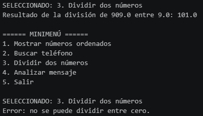
### Salida de OPCIÓN 4
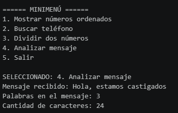
### Salida al seleccionar opción invalida y OPCION 5 para finalizar programa
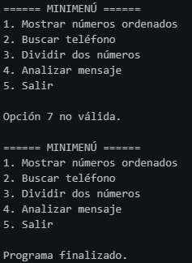

---